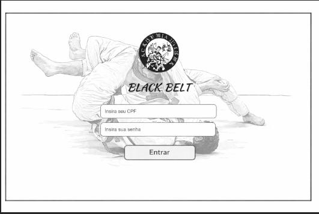
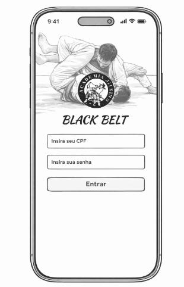
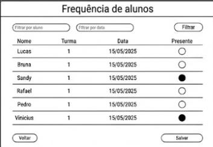
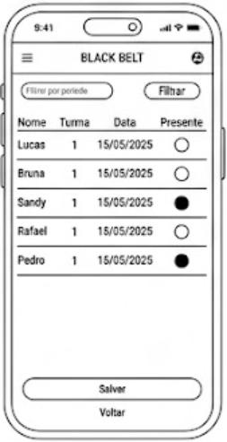
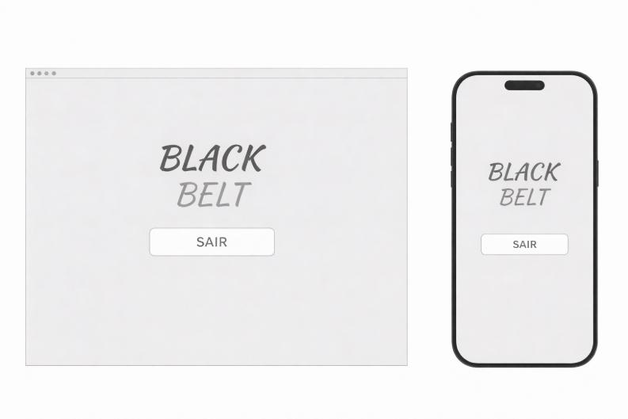
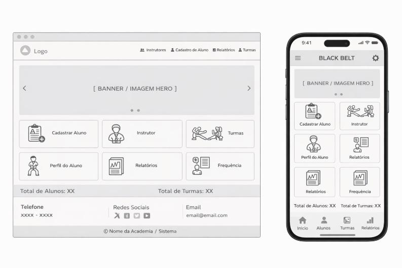
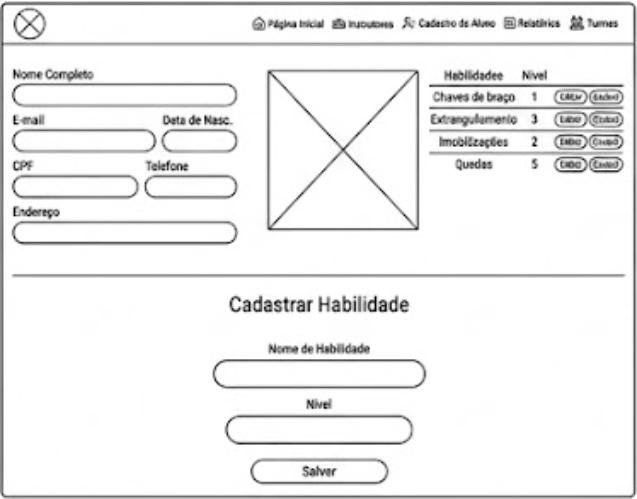
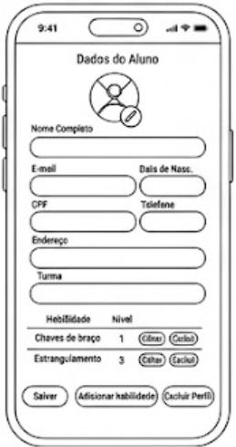
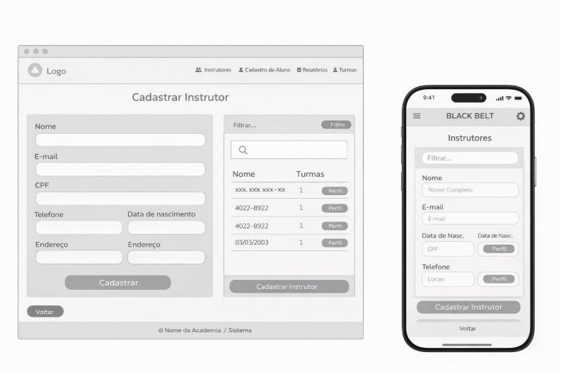

# 5. Protótipos

## **a. Tela de entrada**

* **Processos envolvidos:** login de usuários da aplicação;

## **b. Tela de frequência de alunos**

* **Processos envolvidos:**  Lançamento da presença dos alunos na aula do dia, de acordo com cada turma;

## **c. Tela de saída**

* **Processos envolvidos: logout do usuário da aplicação;**

## **d. Menu Inicial**

* **Processos envolvidos:**  links para as telas de cadastro de alunos, cadastro de instrutores, turmas, perfis de alunos, relatórios e frequências;

## **e. Cadastro de aluno e habilidades**

* **Processos envolvidos: Cadastro de aluno e suas devidas habilidades, ranqueadas por níveis;

## **f. Cadastro de Instrutores**

* **Processos envolvidos: Cadastro de instrutor e visualização das turmas relacionadas ao mesmo;

## **g. Controle Financeiro dos Mensalistas**
[Controle Financeiro dos Mensalistas](images/g.Controle-Financeiro-dos-Mensalistas.jpeg)

* **Processos envolvidos: Listagem dos alunos de forma que o usuário administrador acompanha o pagamento das mensalidades deles. 
